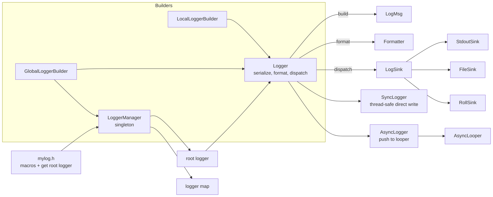
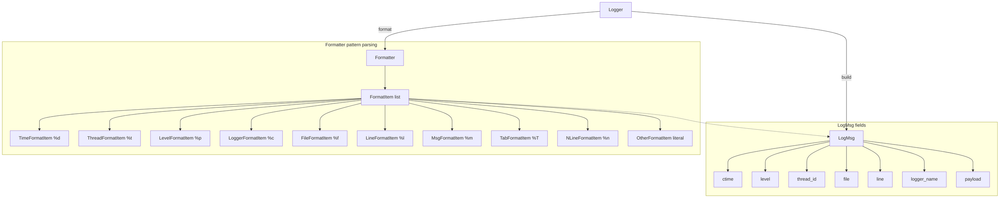
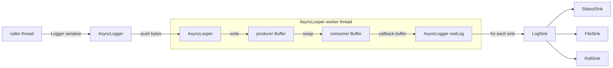
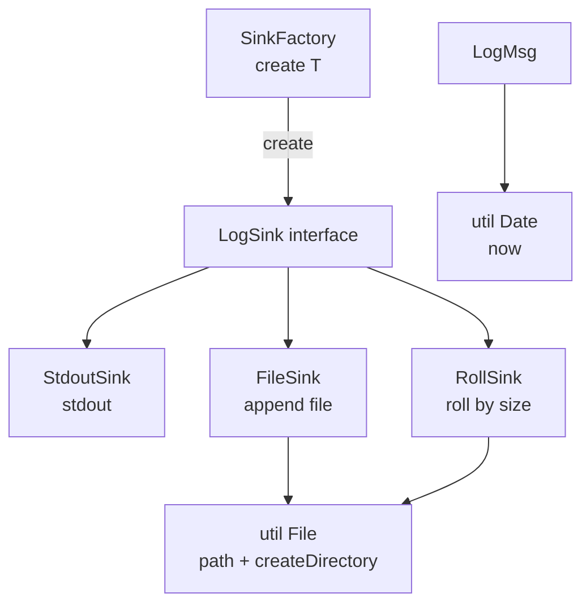

# Logs Project Structure (focus: logs/)

## 1) Overview (high level)

```mermaid
%%{init: {"flowchart": {"useMaxWidth": false, "nodeSpacing": 40, "rankSpacing": 60}}}%%
graph LR
  mylogh[mylog.h\nmacros + get root logger] --> LoggerManager[LoggerManager\nsingleton]
  LoggerManager --> root[root logger]
  LoggerManager --> map[logger map]

  subgraph Builders
    LocalBuilder[LocalLoggerBuilder] --> Logger
    GlobalBuilder[GlobalLoggerBuilder] --> Logger
    GlobalBuilder --> LoggerManager
  end

  root --> Logger[Logger\nserialize, format, dispatch]

  Logger -->|build| LogMsg
  Logger -->|format| Formatter
  Logger -->|dispatch| LogSink

  Logger --> SyncLogger[SyncLogger\nthread-safe direct write]
  Logger --> AsyncLogger[AsyncLogger\npush to looper]
  AsyncLogger --> AsyncLooper

  LogSink --> StdoutSink
  LogSink --> FileSink
  LogSink --> RollSink
```

## 2) Formatter + LogMsg (details)

```mermaid
%%{init: {"flowchart": {"useMaxWidth": false, "nodeSpacing": 35, "rankSpacing": 60}}}%%
graph TB
  Logger -->|build| LogMsg
  Logger -->|format| Formatter

  subgraph LogMsgFields[LogMsg fields]
    LogMsg --> ctime[ctime]
    LogMsg --> level[level]
    LogMsg --> tid[thread_id]
    LogMsg --> file[file]
    LogMsg --> line[line]
    LogMsg --> loggerName[logger_name]
    LogMsg --> payload[payload]
  end

  subgraph Pattern[Formatter pattern parsing]
    Formatter --> Items[FormatItem list]
    Items --> TimeItem[TimeFormatItem %d]
    Items --> ThreadItem[ThreadFormatItem %t]
    Items --> LevelItem[LevelFormatItem %p]
    Items --> LoggerItem[LoggerFormatItem %c]
    Items --> FileItem[FileFormatItem %f]
    Items --> LineItem[LineFormatItem %l]
    Items --> MsgItem[MsgFormatItem %m]
    Items --> TabItem[TabFormatItem %T]
    Items --> NLineItem[NLineFormatItem %n]
    Items --> OtherItem[OtherFormatItem literal]
  end

  Items -.-> LogMsg
```

## 3) Async pipeline (how AsyncLogger writes)

```mermaid
%%{init: {"flowchart": {"useMaxWidth": false, "nodeSpacing": 40, "rankSpacing": 70}}}%%
graph LR
  App[caller thread] -->|Logger serialize| AsyncLogger
  AsyncLogger -->|push bytes| AsyncLooper

  subgraph LooperThread[AsyncLooper worker thread]
    AsyncLooper -->|write| ProBuf[producer Buffer]
    ProBuf -->|swap| ConBuf[consumer Buffer]
    ConBuf -->|callback buffer| RealLog[AsyncLogger realLog]
  end

  RealLog -->|for each sink| LogSink
  LogSink --> StdoutSink
  LogSink --> FileSink
  LogSink --> RollSink
```

## 4) Sinks + util (filesystem + time)

```mermaid
%%{init: {"flowchart": {"useMaxWidth": false, "nodeSpacing": 40, "rankSpacing": 60}}}%%
graph TB
  SinkFactory[SinkFactory\ncreate T] -->|create| LogSink[LogSink interface]
  LogSink --> StdoutSink[StdoutSink\nstdout]
  LogSink --> FileSink[FileSink\nappend file]
  LogSink --> RollSink[RollSink\nroll by size]

  FileSink --> FileUtil[util File\npath + createDirectory]
  RollSink --> FileUtil
  LogMsg[LogMsg] --> DateUtil[util Date\nnow]
```
